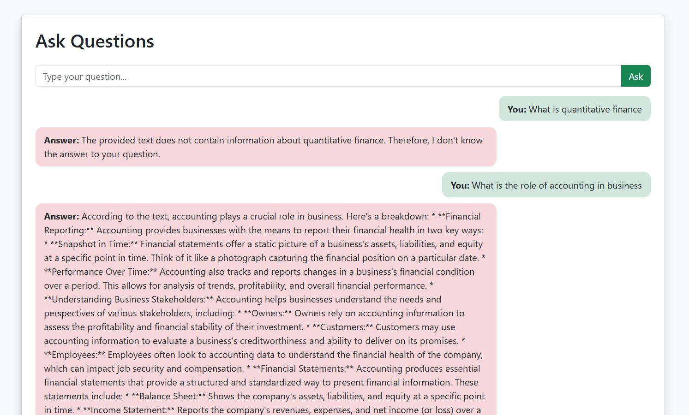

###  DOCURAG

This project implements a **document ingestion and Q&A pipeline** using **LangChain**, **Milvus**, **Google Generative AI**, and **Groq’s LLMs**. It supports various vector indexing and retrieval strategies, enabling **flexible and efficient semantic search** over large unstructured documents such as PDFs.


## 🚀 Installation & Usage

### 1. Create a Conda Environment

```bash
conda create -n docurag python=3.10
conda activate docurag
```

### 2. Install Requirements 

``` bash
pip install -r requirements.txt
```

### 3. Run app.py 
```bash
python app.py
```

### Sample



## Ablation

The Average Retreival time taken for Flat index with MMR Retreival is : **3.35** seconds. 

