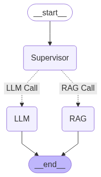

# 🍳 AI Recipe & Knowledge Assistant

A Flask-based web application powered by **LangGraph**, **LangChain**, and **LLMs** (GROQ or Google) to answer user queries intelligently. It distinguishes between **food recipe** queries and **general knowledge** questions using a smart Supervisor node, and routes them accordingly.

---

### 🗂️ Table of Contents

- [Overview](#overview)
- [Features](#features)
- [Architecture](#architecture)
- [Installation](#installation)
- [Environment Variables](#environment-variables)
- [Running the App](#running-the-app)
- [Folder Structure](#folder-structure)
- [Contributing](#contributing)
- [License](#license)

---

### 📌 Overview

This project demonstrates an **AI-powered assistant** that can:
- Answer general knowledge questions using an LLM.
- Provide detailed food recipes using a Retrieval-Augmented Generation (RAG) pipeline.
- Use real-time web search if needed (e.g., for latest news).

---

### ✨ Features

- 🧠 Smart classification using the **Supervisor** node.
- 🧾 RAG pipeline for food-related queries using FAISS + LangChain.
- 🔍 Live search tool using **Tavily Search API**.
- 📦 Modular, scalable, and extensible workflow via **LangGraph**.
- 🖥️ Frontend using HTML templates with a simple POST API.

---

### 🧠 Architecture

The application uses a graph-based workflow:

- **Supervisor**: Classifies the user query.
- **Router**: Directs the query to either `LLM` or `RAG` based on topic.
- **LLM Node**: Uses ChatGroq or ChatGoogleGenerativeAI to answer general questions.
- **RAG Node**: Searches FAISS-based recipe database and responds with structured output.
- **WebCrawlerTool**: Fetches live web data when required.

---

#### 🧭 Workflow Diagram



---

### ⚙️ Installation

```bash
git clone https://github.com/your-repo/ai-recipe-assistant.git
cd ai-recipe-assistant
python -m venv venv
source venv/bin/activate  # or venv\Scripts\activate on Windows
pip install -r requirements.txt
